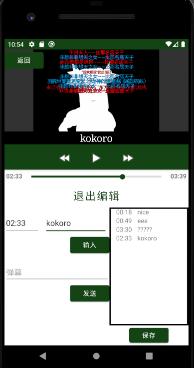
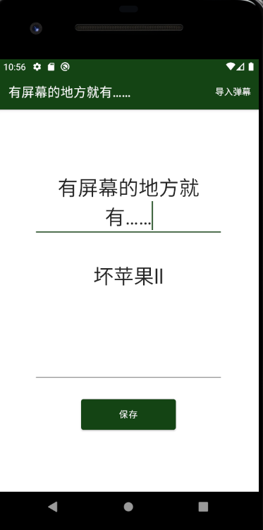
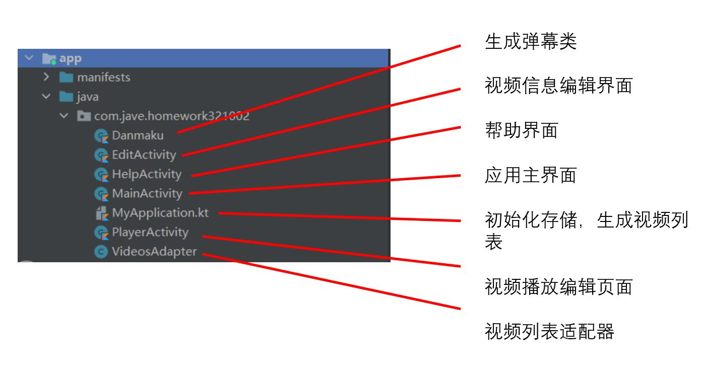
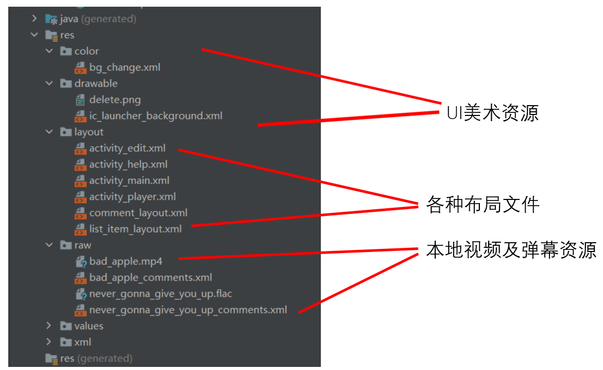
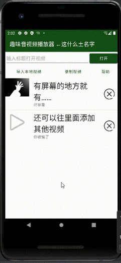
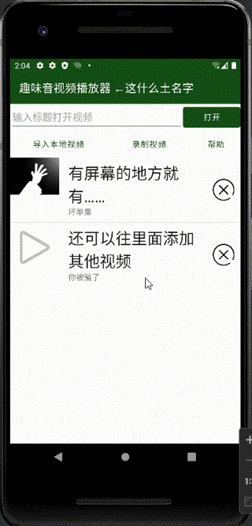

# 趣味本地音视频安卓播放器

## 软件介绍

这是一个趣味音视频安卓播放器，为Daniel-ChenJH在上海交大-字节跳动联合开设的2021年春季课程《安卓应用开发实训》课程的大作业，它可以导入本地视频或录制新视频后播放。

除了传统视频播放器的开始/暂停以及快进/快退功能以外，对于给定的视频，它能加载已有弹幕，也可以加入新弹幕和设定时间点字幕等，让观影过程更加有趣！

如果你对任何地方感到疑惑，程序的“帮助”页或许能帮到你。

### 主页面

### 视频新弹幕发送页、编辑页

### 主要功能
- 导入本地视频：点击主页面的导入按钮，打开设备本地相册，选取视频导入，之后可在主页面视频列表中查看和编辑。
- 录制视频：点击主页面录制按钮，调用设备相机功能，获取权限后可开始录制，录制完成后视频将自动保存到app中，可查看和编辑。
- 视频播放：点击列表视频进入播放页面，可通过进度条直接跳转和快进。
- 歌词/字幕编辑：点击视频播放器右上方图标，下方弹出编辑界面。输入时间点和歌词、字幕内容，用户可在右侧记录本查看自己写的内容，点击保存后将歌词字幕加载进视频中。之后的查阅用户便可以看到自己记录的歌词字幕，点击记录本中的内容可以跳转到对应的时间点进行查看。
- 视频弹幕：每个视频都有自己的本地弹幕，播放视频时会随着时间自动播放本地弹幕。用户也可以在编辑页面发送弹幕，弹幕会被保存在本地的app中。
- 视频信息编辑：长按主页面列表中的视频，进入视频信息编辑页面，用户可以修改视频的信息和简介并进行保存。点击右上方的加载弹幕文件，用户可以从本地导入xml弹幕文件（参考bilibili）加载视频弹幕。
- 视频列表过滤：用户在主页面搜索框输入字符，app会根据输入内容自动过滤视频列表，点击打开会播放字条内容最相符的视频。

## 主要技术
- 文件系统存储
- UI动画制作
- 自定义UI控件
- 多媒体权限调用
- 视频加载、播放、控制技术
- Activity间互相交互
- 应用程序生命周期监听
- 动作监听
- 列表刷新技术
- Kotlin数据类

## 项目结构

## 代码结构

## 项目难点
- 视频加载、播放和控制

- 视频和弹幕文件的持久化存储

- 调用系统相机并拍摄视频存储

- 主页面视频列表的显示与更新

## 项目效果展示

## 小组成员

陈镕，韩亦多BRIANHAN，陈景浩，邹铭宸